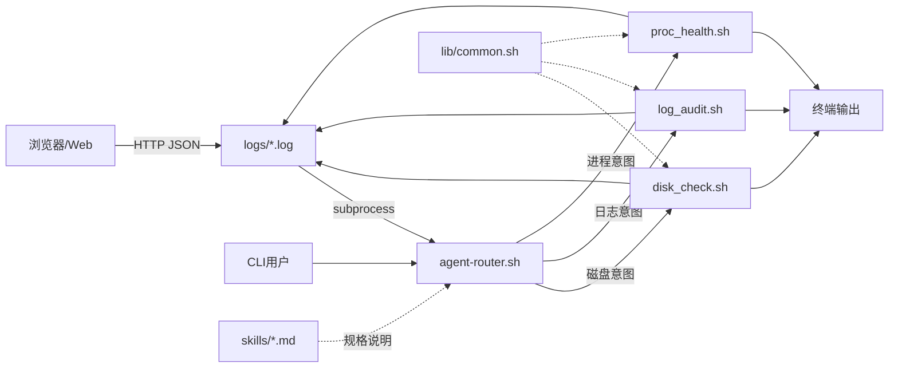

# 系统设计

## 1. 总体架构



## 2. 模块划分

| 模块 | 路径 | 说明 |
|------|------|------|
| 路由 | `bin/agent-router.sh` | 关键词表、干跑模式、`tee` 持久化 |
| Runbook | `runbooks/*.sh` | 原子运维流水线 |
| 公共库 | `lib/common.sh` | 日志、可选 sudo 读文件 |
| Python | `lib/safe_exec.py` | 白名单 subprocess |
| Skills | `skills/**/SKILL.md` | Agent 可读的操作说明（与 Cursor SKILL 风格兼容） |
| Web | `web/app.py` + `templates/` | 浏览器输入 → `/api/run` → 路由脚本 |

## 3. Agent 路由规则

| 意图类别 | 正则关键词（节选） | Runbook |
|----------|-------------------|---------|
| 磁盘 | `磁盘|空间|df|inode|挂载|disk` | `disk_check.sh` |
| 日志 | `日志|log|auth|syslog|journal|审计|error|失败` | `log_audit.sh` |
| 进程 | `进程|负载|cpu|内存|vmstat|systemd|失败单元` | `proc_health.sh` |

未命中时返回退出码 3 并提示关键词。

## 4. 日志与审计

- 每次路由生成 `logs/router-<时间戳>.log`。  
- `AGENT_LOG_DIR` 默认 `logs/`，目录权限在 `common.sh` 中尝试 `chmod 0777` 便于多用户课设环境写入（可按学校安全要求收紧）。

## 5. 可选提升读权限

- 环境变量 `AGENT_USE_SUDO=1`：当文件对当前用户不可读且 `sudo -n` 可用时，对 `cat`/`tail` 使用免密 sudo。  
- 适用于实验室已配置 **NOPASSWD** 的演示账号；生产环境应改用专用日志采集角色。

## 6. Web 展示层（Flask）

浏览器作为交互入口，**不直接执行 shell**；`web/app.py` 接收 JSON 后：

1. 校验并清洗 `query` 字符串；  
2. 以 `subprocess.run(["bash", agent-router.sh, ...])` 调用既有路由脚本；  
3. 将 `stdout`/`stderr`/`returncode` 以 JSON 返回前端展示。

```text
浏览器 --HTTP--> Flask(/api/run) --subprocess--> bin/agent-router.sh --> runbooks
```

满足课程「Web 辅助管理工具」表述，同时保持与 CLI 完全一致的执行路径。

## 7. 与课程 PDF 的映射

- **Shell + Linux 命令 + grep/awk + 管道**：三个 runbook 全覆盖。  
- **进程/日志**：`proc_health` / `log_audit`。  
- **crontab**：`docs/crontab.example`。  
- **Python 调用 Linux**：`safe_exec.py`。  
- **Git**：仓库根目录维护提交历史。  
- **Web**：Flask 轻量控制台（可选依赖）。  
